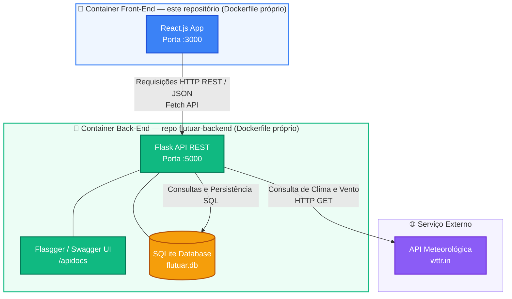

# Flutuar Parapente - Gerenciador de Alunos (Front-End)

O **Flutuar Parapente** é uma aplicação web de front-end desenvolvida como MVP para o curso de pós-graduação em Desenvolvimento Full Stack da PUC-Rio. O sistema foi projetado para gerenciar o fluxo de alunos e pilotos de uma escola de voo livre, permitindo o cadastro, a filtragem por nível de curso e o acompanhamento de métricas em tempo real.

## 🚀 Tecnologias Utilizadas

* **React** (Componentização e arquitetura base)
* **React Router Dom** (Gerenciamento de rotas dinâmicas e navegação SPA)
* **Hooks do React:**
  * `useState`: Gerenciamento de estado local (filtros, modais e dados).
  * `useEffect`: Sincronização automática com a API back-end (busca de dados ao carregar as páginas).
  * `useParams` e `useNavigate`: Captura de parâmetros na URL e navegação interna.
* **Fetch API**: Consumo em tempo real da **Flutuar API** (repositório [`flutuar-backend`](https://github.com/cristianoricci/flutuar-backend)), responsável por todo o CRUD de alunos e pela consulta de clima.
* **HTML5 Semântico & CSS3 Customizado** (Layout responsivo com CSS Grid e Flexbox).
* **Docker** — containerização da aplicação.

## 📐 Arquitetura da Solução

Este projeto é o componente **principal (Interface)** do MVP de Backend Avançado da PUC-Rio, seguindo o **Cenário 1.1**: a Interface React consome uma API Back-End própria (repositório separado [`flutuar-backend`](https://github.com/cristianoricci/flutuar-backend)), que por sua vez persiste dados em SQLite e consulta uma API externa de clima.



### 🔄 Fluxo de Comunicação do Sistema

1. **Interface (este repositório):** o React envia requisições HTTP via Fetch API para a Flutuar API.
2. **API Back-End (`flutuar-backend`):** processa as regras de negócio e persiste os dados dos alunos no SQLite.
3. **Integração Externa:** a API back-end consulta o serviço **wttr.in** para trazer as condições de vento e voo, exibidas no painel de clima desta interface.

## 📦 Funcionalidades Implementadas

* **Dashboard/Painel Central:** Página inicial de boas-vindas com acesso rápido à navegação do sistema.
* **Estatísticas em Tempo Real:** Painel de métricas (total de alunos, distribuição por curso) exibido na página "Gerenciar Alunos", atualizado dinamicamente conforme os dados são cadastrados ou filtrados.
* **Listagem Responsiva:** Cards estilizados por categoria de curso (Iniciante, Cross Country e Voo Duplo) que se adaptam a qualquer tamanho de tela.
* **Filtros e Busca:** Filtragem rápida de pilotos por categoria e por nome, sem recarregamento de página.
* **Ficha Cadastral Dinâmica (`/alunos/:id`):** Rota que busca e exibe os dados detalhados do aluno diretamente na API back-end, utilizando o ID da URL.
* **CRUD Completo via API:** Cadastro, listagem, atualização e remoção de alunos, com todos os dados persistidos no back-end (SQLite), refletindo em tempo real após cada operação.
* **Painel de Clima:** Consulta em tempo real das condições de vento e voo, via API back-end.
* **Feedback ao Usuário:** Indicador de carregamento, mensagens de erro em formulários e aviso de "nenhum resultado encontrado" nos filtros.
* **Página 404:** Rota de fallback para URLs inexistentes.

## ⚠️ Pré-requisito

Esta interface depende da **Flutuar API** rodando localmente para funcionar por completo (listagem, cadastro, edição, exclusão de alunos e consulta de clima). Antes de iniciar o front-end, suba o back-end seguindo as instruções do repositório [`flutuar-backend`](https://github.com/cristianoricci/flutuar-backend) — ele deve estar disponível em `http://localhost:5000`.

## 🔧 Como Executar o Projeto Localmente

Certifique-se de ter o [Node.js](https://nodejs.org/) instalado em seu ambiente (recomendado: versão 20 ou superior).

1. Clone o repositório para sua máquina local:
```bash
git clone https://github.com/cristianoricci/flutuar-react.git
cd flutuar-react
```

2. Instale as dependências do projeto:
```bash
npm install
```

3. Inicie o servidor de desenvolvimento:
```bash
npm run dev
```

4. Abra o navegador em `http://localhost:5173` (com o back-end já rodando em `http://localhost:5000`).

## 🐳 Como Executar via Docker

1. Construa a imagem:
```bash
docker build -t flutuar-ui .
```

2. Execute o container:
```bash
docker run -p 3000:3000 flutuar-ui
```

3. Acesse `http://localhost:3000` (com o back-end já rodando em `http://localhost:5000`).

## 📁 Estrutura do Projeto

```
flutuar-react/
├── src/
│   ├── components/       # Componentes reutilizáveis (Header, AlunoCard, FilterBar, Modal, StatsBar, PainelClima)
│   ├── pages/
│   │   └── Alunos.jsx    # Página de listagem, cadastro, edição e exclusão de alunos (consome a API)
│   ├── App.jsx            # Rotas da aplicação e telas de Dashboard/Detalhes do Aluno
│   ├── main.jsx           # Ponto de entrada da aplicação React
│   └── style.css          # Estilos globais
├── index.html
├── Dockerfile
└── package.json
```

## 📄 Licença

Este projeto foi desenvolvido para fins acadêmicos, como parte do MVP de Backend Avançado da Pós-Graduação em Desenvolvimento Full Stack da PUC-Rio.
